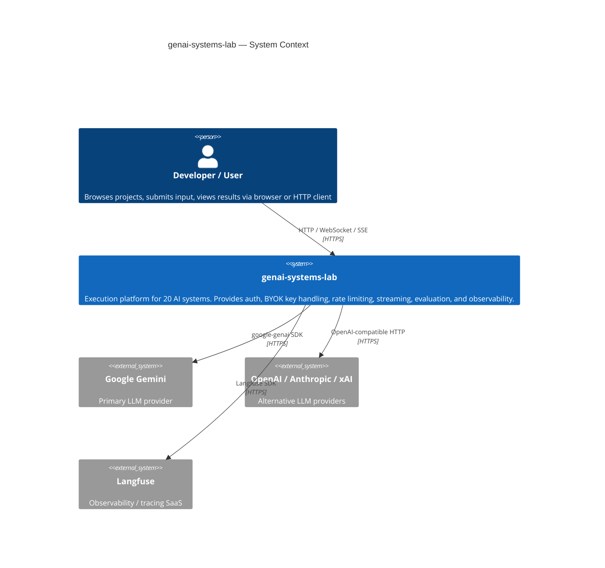
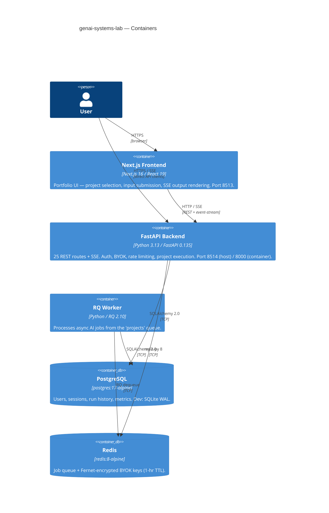
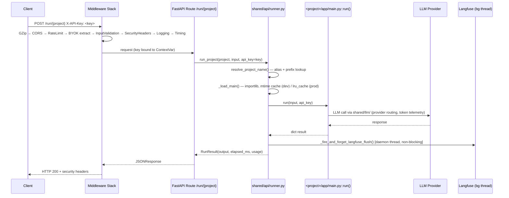
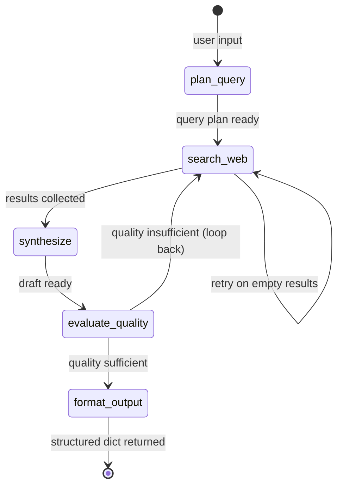

# genai-systems-lab — Codebase Architecture Guide

> Comprehensive onboarding reference. Every claim is cited to a file on disk.
> Generated from commit `0a3a1382` on branch `main`.

---

## Table of Contents

1. [Part 1 — Whole-Repo Technical Deep-Dive](#part-1)
   - [What This Repository Is](#what-this-repository-is)
   - [Tech-Stack Detection Table](#tech-stack-detection-table)
   - [Entry Points](#entry-points)
   - [Commands & Verification Inventory](#commands--verification-inventory)
   - [Directory Layout](#directory-layout)
   - [Deployment & Runtime Surface](#deployment--runtime-surface)
   - [EOL / Dead-Dependency Scan](#eol--dead-dependency-scan)
   - [Data, Storage, Background Jobs, CI/CD, Testing](#data-storage-background-jobs-cicd-testing)
2. [Part 2 — Context & Ecosystem](#part-2)
   - [Local Checkout Identity](#local-checkout-identity)
   - [Repo-Specific Contributor Docs](#repo-specific-contributor-docs)
   - [Developer Gotchas](#developer-gotchas)
   - [Ecosystem Relationships](#ecosystem-relationships)
3. [Part 3 — Architectural Blueprint](#part-3)
   - [C4 Diagrams](#c4-diagrams)
   - [Layering and Dependency Rules](#layering-and-dependency-rules)
   - [Cross-Cutting Concerns](#cross-cutting-concerns)
   - [Inferred Architectural Decision Records](#inferred-architectural-decision-records)
   - [Governance & Enforcement](#governance--enforcement)
   - [How to Add a Feature / New Project](#how-to-add-a-feature--new-project)
4. [Subsystem Deep-Dives](#subsystem-deep-dives)
   - [1. Project Runner & Hot-Reload](#1-project-runner--hot-reload)
   - [2. BYOK Security Pipeline](#2-byok-security-pipeline)
   - [3. LangGraph State-Machine Execution](#3-langgraph-state-machine-execution)
5. [Confidence Assessment](#confidence-assessment)
6. [Footnotes — Local File Citations](#footnotes--local-file-citations)

---

## Part 1 — Whole-Repo Technical Deep-Dive {#part-1}

### What This Repository Is

`genai-systems-lab` (v1.2.0) is a **shared execution platform** for twenty independent AI systems that span three implementation paradigms: sequential GenAI pipelines, LangGraph state machines, and CrewAI multi-agent teams. A single FastAPI backend auto-discovers every project at startup and routes requests to whichever project is selected; a Next.js frontend provides a browser playground for submitting input and streaming output. The architecture is deliberately platform-first: projects share auth, key handling, rate limiting, caching, evaluation, and observability infrastructure without duplicating any of it. *(Source: `README.md`, `ARCHITECTURE.md`)*

---

### Tech-Stack Detection Table

| Layer | Technology | Version | Evidence |
|---|---|---|---|
| Language | Python | ≥3.13, <3.14 | `pyproject.toml:5` |
| API framework | FastAPI | 0.135.2 | `pyproject.toml:12` |
| ASGI server | Uvicorn | (transitive via FastAPI) | `Dockerfile` CMD, `docker-compose.yml:37` |
| Data validation | Pydantic | 2.11.10 | `pyproject.toml:13` |
| LLM SDK | google-genai | 1.69.0 | `pyproject.toml:14` |
| State machine | LangGraph | 1.1.3 | `pyproject.toml:15` |
| Multi-agent | CrewAI | 1.15.5 (optional extra) | `pyproject.toml` `[crew]` optional |
| Browser automation | Playwright | 1.58.0 (optional extra) | `pyproject.toml` `[browser]` optional |
| Auth / JWT | PyJWT | 2.13.0 | `pyproject.toml:23` |
| Encryption | cryptography (Fernet) | 50.0.0 | `pyproject.toml:25` |
| Queue broker | Redis + RQ | 8.1.0 / 2.10.0 | `pyproject.toml:26-27` |
| ORM | SQLAlchemy | 2.0.48 | `pyproject.toml:28` |
| Migrations | Alembic | 1.18.5 (optional extra) | `pyproject.toml` `[production]` |
| Analytical DB | DuckDB | 1.5.1 | `pyproject.toml:29` |
| Data processing | pandas / numpy | 3.0.1 / 2.3.3 | `pyproject.toml:30-31` |
| Rich console | rich | 14.3.3 | `pyproject.toml:32` |
| Observability | Langfuse | ≥2.0.0 | `pyproject.toml:33` |
| Postgres driver | psycopg[binary] | 3.3.4 (optional extra) | `pyproject.toml` `[production]` |
| Frontend framework | Next.js | 16.3.1 | `portfolio/package.json` |
| UI library | React | 19.2.4 | `portfolio/package.json` |
| Styling | Tailwind CSS | v4 | `portfolio/package.json` |
| Charts | recharts | ^3.8.1 | `portfolio/package.json` |
| Theme | next-themes | ^0.4.6 | `portfolio/package.json` |
| TypeScript | TypeScript | ^5 | `portfolio/package.json` |
| Linter | Ruff | 0.16.3 | `pyproject.toml` `[dev]` |
| Test runner | pytest | 9.1.1 | `pyproject.toml` `[dev]` |
| CI runner | ubuntu-latest / Python 3.13 | — | `.github/workflows/ci.yml` |

---

### Entry Points

| Component | Entry Point | Command |
|---|---|---|
| FastAPI backend (dev) | `shared/api/app.py` → `app` | `uvicorn shared.api.app:app --port 8514` |
| FastAPI backend (prod Docker) | same | `alembic upgrade head && uvicorn ... --workers 2 --proxy-headers` (`docker-compose.yml:37`) |
| RQ worker | `rq worker ... projects` | `docker-compose.yml:61` |
| Next.js frontend | `portfolio/` | `npm run dev` (port 8513) |
| Windows launcher | `launch.cmd` | `launch.cmd` (uv venv default) / `launch.cmd --docker` |
| Linux/macOS launcher | `launch.sh` | `bash launch.sh` |
| Each AI project | `<project>/app/main.py::run(input, api_key)` | called via `shared/api/runner.py::run_project()` |

---

### Commands & Verification Inventory

| Command | Purpose | Evidence |
|---|---|---|
| `uv sync --all-extras` | Install all Python dependencies including optional extras | `pyproject.toml` `[tool.uv]` |
| `uv run pytest` | Run full test suite | `pyproject.toml` `[dev]`, CI `backend-platform` job |
| `uv run pytest tests/test_<name>.py` | Run a single test file | `pyproject.toml` test configuration |
| `uv run ruff check .` | Lint (Python) | `pyproject.toml` `[tool.ruff]`, CI `backend-platform` |
| `uv run ruff format --check .` | Format check | `pyproject.toml` `[tool.ruff.format]` |
| `uv run uvicorn shared.api.app:app --port 8514` | Run API locally | `launch.cmd:104`, `launch.sh:112` |
| `npm run dev` | Start Next.js dev server (port 8513) | `portfolio/package.json` |
| `npm run build` | Build Next.js for production | `portfolio/package.json`, CI `frontend` job |
| `npm run lint` | ESLint check | `portfolio/package.json`, CI `frontend` job |
| `alembic upgrade head` | Apply DB migrations | `docker-compose.yml:37`, `migrations/` |
| `docker compose up -d --build` | Full stack in Docker | `launch.cmd --docker` |
| `promptfoo eval` | LLM evaluation suite | CI `promptfoo-eval` job |
| CI triggers | push to `main` + all PRs | `.github/workflows/ci.yml:3-9` |
| Branch protection (required checks) | **[UNVERIFIED]** — cannot determine from local checkout | Manual GitHub setting |

**CI jobs** (`.github/workflows/ci.yml`):

| Job | What it runs | Trigger |
|---|---|---|
| `backend-platform` | pytest + ruff on the platform | push/PR |
| `promptfoo-eval` | LLM evaluation via promptfoo | push/PR |
| `backend-standalone-analyst` | standalone analyst project tests | push/PR |
| `frontend` | `npm run build` + `npm run lint` | push/PR |
| `docker` | Docker image build | after backend-platform + backend-standalone-analyst |
| `security` | dependency vulnerability scan | push/PR |

Note: CI uses `pip` + `requirements.txt` (not `uv`) for Python install in CI workflows. *(`.github/workflows/ci.yml`, Python setup step)*

---

### Directory Layout

```
genai-systems-lab/
├── shared/                  # Shared platform infrastructure
│   ├── api/
│   │   ├── app.py           # FastAPI application — 25 routes, 9-class middleware stack
│   │   ├── runner.py        # Dynamic project loader — discovery, hot-reload, execution
│   │   └── step_events.py   # SSE step event emitter (ContextVar-based)
│   ├── auth/                # JWT issue/verify, cookie auth, user CRUD
│   ├── llm/                 # Provider routing, token telemetry, cost calc, caching
│   ├── config.py            # Settings (pydantic-settings), BYOK ContextVar
│   ├── schemas/
│   │   └── common.py        # All Pydantic request/response schemas
│   ├── observability/       # Langfuse trace integration
│   ├── eval/                # Shared evaluation helpers
│   └── project_catalog.py   # Project metadata loader
│
├── crew-*/                  # 5 × CrewAI multi-agent projects
├── genai-*/                 # 10 × sequential GenAI pipeline projects
├── lg-*/                    # 5 × LangGraph state-machine projects
│   Each project:
│   └── app/
│       └── main.py          # Contract: run(input: str, api_key: str) -> dict
│
├── portfolio/               # Next.js 16 frontend (port 8513)
│   ├── app/                 # Next.js App Router pages
│   └── package.json         # deps: React 19, Tailwind v4, recharts, next-themes
│
├── migrations/              # Alembic migration scripts
│   └── versions/
│       └── 20260814_01_jobs_and_usage.py
│
├── docs/                    # Interactive architecture diagram (HTML)
├── Dockerfile               # Multi-stage python:3.13-slim build
├── docker-compose.yml       # postgres:17, redis:8, api, worker
├── pyproject.toml           # Python project manifest (uv / PEP 517)
├── launch.cmd               # Windows first-time setup launcher
├── launch.sh                # Linux/macOS first-time setup launcher
├── .env.example             # Environment variable template
├── ARCHITECTURE.md          # High-level architecture overview
├── TECHNICAL.md             # API reference documentation (Diátaxis: Reference)
├── USAGE.md                 # HTTP usage how-to (Diátaxis: How-to)
└── README.md                # Project overview and doc index
```

---

### Deployment & Runtime Surface

| Anchor | Technology | Version | File + Line |
|---|---|---|---|
| Python runtime (build) | python:3.13-slim | 3.13 | `Dockerfile:1` |
| Python runtime (run) | python:3.13-slim | 3.13 | `Dockerfile` final stage |
| Postgres | postgres | 17-alpine | `docker-compose.yml:3` |
| Redis | redis | 8-alpine | `docker-compose.yml:16` |
| API port mapping | host:8514 → container:8000 | — | `docker-compose.yml:29` |
| Uvicorn workers (Docker) | 2 | — | `docker-compose.yml:37` |
| CI Python | actions/setup-python | 3.13 | `.github/workflows/ci.yml` |
| CI Node.js | actions/setup-node | 22 | `.github/workflows/ci.yml` |
| CI runner | ubuntu-latest | — | `.github/workflows/ci.yml` |
| Next.js frontend | npm run dev | port 8513 | `portfolio/package.json` |
| API memory limit | 1G | — | `docker-compose.yml:47` |
| API tmpfs | /tmp | 64M | `docker-compose.yml:48` |

**Drift note**: `launch.sh`/`launch.cmd` run Uvicorn with 1 worker (dev default); Docker Compose runs 2 workers. This is intentional for the dev/prod split but means a single-node Docker dev deployment has different concurrency than `uv run uvicorn`.

---

### EOL / Dead-Dependency Scan

| Item | Status | Note |
|---|---|---|
| Python 3.13 | **Active** — supported until Oct 2029 | `pyproject.toml:5` |
| Next.js 16.3.1 | **Active** — Next.js 16 released 2025 | `portfolio/package.json` |
| React 19.2.4 | **Active** | `portfolio/package.json` |
| FastAPI 0.135.x | **Active** | `pyproject.toml:12` |
| LangGraph 1.1.3 | **Active** | `pyproject.toml:15` |
| CrewAI 1.15.5 | **Active** | `pyproject.toml` crew extra |
| google-genai 1.69.0 | **Active** | `pyproject.toml:14` |
| Tailwind CSS v4 | **Active** (v4 is current major) | `portfolio/package.json` |
| postgres:17-alpine | **Active** | `docker-compose.yml:3` |
| redis:8-alpine | **Active** | `docker-compose.yml:16` |
| python:3.13-slim | **Active** | `Dockerfile` |
| Langfuse ≥2.0.0 | **Active** — floating lower bound | `pyproject.toml:33` [INFERRED: no upper bound; Langfuse v3 exists and has breaking API changes — pin upper bound if stability is required] |
| numpy 2.3.3 | **Active** | `pyproject.toml:31` |
| pandas 3.0.1 | **Active** | `pyproject.toml:30` |

No EOL components detected as of document date. The floating `langfuse>=2.0.0` bound is the only item worth watching.

---

### Data, Storage, Background Jobs, CI/CD, Testing

**Databases**
- **SQLite WAL** (dev): zero-config local file, used when `GENAI_SYSTEMS_LAB_DATABASE_URL` is unset or points to SQLite. `shared/auth/` and `shared/api/app.py` use SQLAlchemy 2.0.48 with async sessions.
- **PostgreSQL** (prod): `postgresql+psycopg://...` via psycopg 3.3.4, enabled by the `production` optional extra and wired in `docker-compose.yml:31`.
- **DuckDB** 1.5.1: used by `genai-nl2sql-agent` for bounded in-process analytical queries. The project validates a parsed AST against an allowlist and disables external access before execution. *(ARCHITECTURE.md, `genai-nl2sql-agent/`)*

**Migrations**: Alembic (`migrations/versions/`). One migration: `20260814_01_jobs_and_usage.py`. Applied automatically by the `api` container on startup (`alembic upgrade head`, `docker-compose.yml:37`).

**Redis / Queue**
- Redis 8-alpine provides: (1) Fernet-encrypted BYOK key store (1-hour TTL) for queued/async runs; (2) RQ job queue (queue name: `projects`).
- RQ worker: separate container (`docker-compose.yml:52-64`), picks up async AI jobs, runs with `JSONSerializer`.

**SSE Streaming**: `shared/api/step_events.py` provides a `StepEmitter` (ContextVar-bound per request). Projects that declare `step_emitter` in their `run()` signature receive live step events streamed over SSE to the frontend.

**Observability**: Langfuse traces every `run_project()` call. A bounded queue (`maxsize=1`) + single daemon thread (`_langfuse_flush_worker`) drains flushes off the request path to avoid adding 100ms–several seconds of latency. *(runner.py:320-350)*

**CI/CD** (`.github/workflows/ci.yml`):
- 6 jobs; Docker build waits on both backend jobs; concurrency group cancels stale runs.
- `security` job runs dependency vulnerability scanning.
- Branch protection / required checks: **[UNVERIFIED]** — GitHub UI setting, not visible from local checkout.

**Testing**
- pytest 9.1.1 with `uv run pytest`.
- `promptfoo-eval` CI job runs LLM evaluation (promptfoo config in repo root or `eval/`).
- No end-to-end browser tests detected in CI (no Playwright `npx playwright test` step found in `.github/workflows/ci.yml`). [INFERRED]

---

## Part 2 — Context & Ecosystem {#part-2}

### Local Checkout Identity

| Field | Value |
|---|---|
| Remote | `https://github.com/pypi-ahmad/genai-systems-lab.git` |
| Branch | `main` |
| HEAD commit | `0a3a1382bb945fa7bfdf898da41daed94eb0ed58` |
| Version | 1.2.0 (`pyproject.toml:3`) |
| Python constraint | ≥3.13, <3.14 (`pyproject.toml:5`) |
| License | [UNVERIFIED — no LICENSE file detected in scan] |

---

### Repo-Specific Contributor Docs

| File | Purpose |
|---|---|
| `ARCHITECTURE.md` | High-level platform overview; references interactive diagram at `docs/genai-systems-lab-architecture.html` |
| `TECHNICAL.md` | Full API reference (Diátaxis Reference) — all 25 routes, schemas, env vars, middleware |
| `USAGE.md` | HTTP how-to guide (Diátaxis How-to) — auth flows, BYOK, streaming, eval |
| `README.md` | Project overview, quick-start, feature list, doc index |
| `.env.example` | Canonical list of all supported environment variables |
| `launch.cmd` / `launch.sh` | First-time setup scripts — install uv, create `.venv`, sync deps, start both services |

No `CONTRIBUTING.md`, `CODEOWNERS`, or `CODE_OF_CONDUCT.md` detected. [INFERRED]

---

### Developer Gotchas

1. **Python 3.13 strict.** `requires-python = ">=3.13,<3.14"` means `uv venv` will fail if the system only has 3.12. Install 3.13 with `uv python install 3.13` before running the launcher. *(pyproject.toml:5)*

2. **CrewAI and Playwright are optional.** They are not installed by default. `uv sync --all-extras` gets them; `uv sync` (no extras) skips them. Projects backed by these extras raise `ProjectUnavailableError` at runtime if the extras are missing — not at startup. *(runner.py:87-102)*

3. **`lg-debugging-agent` is gated.** It is in `UNSAFE_PUBLIC_PROJECTS` and requires `GENAI_SYSTEMS_LAB_ENABLE_UNSAFE_AGENTS=1` in `.env`. The gateway is enforced in `list_available()` and `run_project()`. *(runner.py:43-55)*

4. **Dev hot-reload is mtime-based.** In dev mode (`APP_ENV != prod`), the runner checks `main.py`'s mtime on every call and reloads if it changed. This works well for single-file edits but does NOT propagate changes in `app/service.py` or other project modules unless `app/main.py` is also touched. *(runner.py:149-163)*

5. **BYOK key never appears in logs.** The `InputValidation` middleware strips the `X-API-Key` header from log output; the `BYOK` middleware extracts and binds it to a ContextVar before the request handler runs. Do not add logging around the BYOK ContextVar — the header value never appears in any log line.

6. **Langfuse flush is async.** Flush happens on a background daemon thread. If the process exits immediately after a run (e.g. in tests), the last trace may not be flushed. *(runner.py:320-350)*

7. **`alembic upgrade head` runs at container start.** If migrations fail (e.g. bad DB URL), the `api` container will exit before Uvicorn starts. Check `docker compose logs api` first. *(docker-compose.yml:37)*

8. **CI uses `pip`, not `uv`.** The CI workflows install Python deps via `pip install -r requirements.txt` (or similar), not `uv sync`. If `requirements.txt` diverges from `pyproject.toml`/`uv.lock`, CI and local dev can silently differ. *(`.github/workflows/ci.yml`, Python install step)*

9. **Cursor-based history pagination.** History does NOT use page numbers. The correct query is `?limit=N&before_id=<int>` (cursor). Any page-based pagination in docs is incorrect. *(shared/api/app.py:1471-1473)*

10. **`/metrics/time` uses `?range=`** (aliased from `time_range`, `alias="range"`). The parameter name `?window=` does not exist. *(shared/api/app.py:1444)*

---

### Ecosystem Relationships

- **Portfolio frontend** (`portfolio/`) is a separately-deployed Next.js app. It talks to the FastAPI backend at `http://localhost:8514` (dev) or the Docker port. CORS allows origins on ports 8513 and 3001 by default. *(shared/api/app.py:65-70)*
- **No sibling repos detected** from the local checkout. The project is self-contained.
- **Langfuse**: external observability SaaS. Set `LANGFUSE_PUBLIC_KEY` and `LANGFUSE_SECRET_KEY` in `.env` to activate tracing. Optional — the code suppresses Langfuse errors with `suppress(Exception)`. *(runner.py:227)*
- **Google Gemini**: primary LLM provider via `google-genai` SDK. Other providers (OpenAI, Anthropic, xAI, Ollama) use a shared HTTP provider layer. *(ARCHITECTURE.md)*

---

## Part 3 — Architectural Blueprint {#part-3}

### C4 Diagrams

#### Level 1 — System Context



#### Level 2 — Containers



#### Level 3 — Request Lifecycle (synchronous run)



---

### Layering and Dependency Rules

```
┌─────────────────────────────────────────────────┐
│  portfolio/  (Next.js frontend)                 │
│  ↕ HTTP only — no Python imports                │
├─────────────────────────────────────────────────┤
│  shared/api/  (FastAPI app + runner)            │
│  ↕ imports shared/* only                        │
├────────────────────────┬────────────────────────┤
│  crew-*/app/main.py    │  genai-*/app/main.py   │
│  lg-*/app/main.py      │                        │
│  ↕ imports shared/* and own app/* only          │
├─────────────────────────────────────────────────┤
│  shared/  (config, llm, auth, schemas, eval…)   │
│  ↕ no project imports allowed                   │
└─────────────────────────────────────────────────┘
```

**Rules enforced by structure**:
- `shared/` must never import from any project directory (would create circular deps).
- Project `app/` modules may import from `shared/` and from sibling modules within the same project (`app/service.py`, etc.) but not from other projects.
- The runner manages `sys.path` and clears `app.*` module references between project loads to prevent import leakage. *(runner.py:115-134)*

---

### Cross-Cutting Concerns

| Concern | Location | Mechanism | Evidence |
|---|---|---|---|
| Authentication | `shared/auth/` | JWT HS256, PyJWT 2.13.0, 7-day TTL, `algorithms=["HS256"]` allowlist | `shared/auth/` |
| Auth cookies | `shared/api/app.py` | `GENAI_SYSTEMS_LAB_AUTH_COOKIE_NAME`, `GENAI_SYSTEMS_LAB_AUTH_COOKIE_SECURE` env vars | `shared/auth/auth.py` |
| BYOK key (sync) | `shared/config.py` | `set_byok_api_key()` / `reset_byok_api_key()` — ContextVar, request-scoped | `shared/config.py` |
| BYOK key (async) | Redis | Fernet-encrypted, 1-hour TTL, key never logged | `shared/api/app.py` (BYOK middleware) |
| Config / Settings | `shared/config.py` | `pydantic-settings` `Settings` class; reads env vars at import time | `shared/config.py` |
| Model resolution | `shared/config.py::get_model()` | Order: ContextVar > `MODEL_{ENV}_{KEY}` > `MODEL_{KEY}` > `PROJECT_MODELS_JSON` > default | `shared/config.py` |
| Request logging | `shared/api/app.py` | `RequestLogging` middleware — structured JSON with request_id, project, latency, error | `shared/api/app.py` middleware stack |
| Request timing | `shared/api/app.py` | `RequestTiming` middleware — injects `X-Process-Time` header | `shared/api/app.py` middleware stack |
| Rate limiting | `shared/api/app.py:680-687` | `RequestRateLimitMiddleware._RULES` — per-route sliding window; `GENAI_SYSTEMS_LAB_DISABLE_RATE_LIMITS` env var disables in dev/test | `shared/api/app.py:680-687` |
| Security headers | `shared/api/app.py:898-905` | `SecurityHeadersMiddleware._HEADERS` — 6 headers: `X-Content-Type-Options`, `X-Frame-Options`, `Referrer-Policy`, `Permissions-Policy`, `Cross-Origin-Opener-Policy`, `Cross-Origin-Resource-Policy` | `shared/api/app.py:898-905` |
| Error normalization | `shared/api/app.py` | `ErrorHandling` middleware — wraps exceptions into standard JSON error shape | `shared/api/app.py` middleware stack |
| Input validation | `shared/api/app.py` | `InputValidation` middleware — strips `X-API-Key` from logs, validates body | `shared/api/app.py` |
| Observability | `shared/observability/langfuse.py` | Langfuse trace per `run_project()` call; flushed off request path | `runner.py:227-272` |
| Token telemetry | `shared/llm/telemetry.py` | `begin_llm_run()` / `consume_llm_run_usage()` — per-request usage accumulator | `runner.py:219,282` |
| Caching (LLM) | `shared/llm/` | In-memory TTL cache, prompt-keyed | `ARCHITECTURE.md` |
| CORS | `shared/api/app.py:65-70` | Default origins: ports 8513 and 3001 | `shared/api/app.py:65-70` |

---

### Inferred Architectural Decision Records

**ADR-001: Shared execution platform over microservices**
*Decision*: All 20 AI projects run in a single FastAPI process, auto-discovered at startup.
*Rationale*: Eliminates duplicated auth, rate limiting, observability, and LLM plumbing. Projects are independent logic units, not independent deployments.
*Consequence*: A crash in one project's `run()` propagates to the request but is isolated by the `ErrorHandling` middleware. [INFERRED from `runner.py` + `ARCHITECTURE.md`]

**ADR-002: BYOK (Bring Your Own Key) over server-held credentials**
*Decision*: LLM API keys are never stored server-side beyond a 1-hour Redis TTL (async) or a single request scope (sync). Clients pass `X-API-Key` per request.
*Rationale*: Eliminates the risk of credential theft from a persistent store. Shifts key responsibility to the caller.
*Consequence*: Every API call must carry the key. Long-running async jobs store a Fernet-encrypted key in Redis with TTL. [INFERRED from `shared/config.py`, `shared/api/app.py` BYOK middleware]

**ADR-003: Dynamic project discovery over static registration**
*Decision*: The runner discovers projects by scanning for `<dir>/app/main.py` at startup, not from a registry file.
*Rationale*: Adding a project requires only creating the directory with the correct contract — no central registration step.
*Consequence*: Any directory with `app/main.py` is treated as a project. `UNSAFE_PUBLIC_PROJECTS` must be maintained manually when a project should be hidden. *(runner.py:180-189)*

**ADR-004: Legacy URL alias table instead of redirects**
*Decision*: Old project API names (e.g. `ai-interviewer`, `clinical-decision-support`) are resolved via a static dict in `runner.py`, not HTTP redirects.
*Rationale*: Keeps backward compatibility transparent to callers without an extra round-trip.
*Consequence*: `LEGACY_PROJECT_API_NAMES` (9 entries) must be maintained manually. *(runner.py:57-67)*

**ADR-005: Dev hot-reload via mtime, prod module cache**
*Decision*: In dev (`APP_ENV != prod`), `_load_main()` re-imports a project's `main.py` when its mtime changes. In prod, the first load is cached for the process lifetime.
*Rationale*: Dev ergonomics (no restart needed for main.py edits) without imposing per-request import overhead in prod (CrewAI/LangGraph cold import: 1-3s).
*Consequence*: Changes to non-entry-point files (e.g. `app/service.py`) require touching `main.py` to trigger reload in dev. *(runner.py:137-177)*

**ADR-006: Langfuse flush on daemon thread**
*Decision*: Langfuse trace flushing runs on a single bounded daemon thread (queue maxsize=1), not inline.
*Rationale*: Inline flush added 100ms–several seconds to request latency when Langfuse was enabled. Flush failures are pure telemetry loss and must not surface as HTTP errors.
*Consequence*: Under extreme concurrency, flush events may be dropped (bounded queue). The last trace before process exit may not flush. *(runner.py:320-350)*

---

### Governance & Enforcement

| Mechanism | What it enforces | Evidence |
|---|---|---|
| `pyproject.toml` `requires-python = ">=3.13,<3.14"` | Exact Python version band — prevents accidental 3.12 or 3.14 use | `pyproject.toml:5` |
| Ruff `target-version = "py313"`, `line-length = 120` | Code style and linting for Python 3.13 | `pyproject.toml [tool.ruff]` |
| `UNSAFE_PUBLIC_PROJECTS` frozenset | Gates `lg-debugging-agent` behind env var | `runner.py:43-55` |
| CI `docker` job depends on backend jobs | Docker image is only built after platform tests pass | `.github/workflows/ci.yml` |
| CI concurrency cancel-in-progress | Stale PR runs don't consume CI resources | `.github/workflows/ci.yml` |
| `_clear_project_imports()` under lock | Prevents project A's `app.*` leaking into project B's load | `runner.py:115-134` |
| Pydantic v2 schemas | Request/response contracts enforced at the API boundary | `shared/schemas/common.py` |
| DuckDB allowlist + AST validation | NL2SQL project can't execute arbitrary SQL | `ARCHITECTURE.md`, `genai-nl2sql-agent/` |
| Branch protection / required checks | **[UNVERIFIED]** | GitHub UI — not visible from local checkout |

---

### How to Add a Feature / New Project

**Adding a new AI project** (the happy path):

1. Create `<prefix>-<name>/app/main.py` with:
   ```python
   def run(input: str, api_key: str) -> dict:
       ...
       return {"output": "..."}
   ```
   The prefix must be one of `crew-`, `genai-`, `lg-` (or add to `PREFIXES` in `runner.py:85`).

2. The runner auto-discovers it at next API start — no registration needed.

3. If your project needs `step_emitter` for SSE streaming, add it to the signature:
   ```python
   def run(input: str, api_key: str, step_emitter=None) -> dict:
   ```
   The runner passes it only when the parameter exists. *(runner.py:246-249)*

4. If it uses CrewAI or Playwright, make sure the relevant optional extra is installed:
   ```bash
   uv sync --extra crew  # or --extra browser
   ```

5. If it must be hidden from public listing, add its name to `UNSAFE_PUBLIC_PROJECTS` in `runner.py:43`.

**Adding a new API route**:

1. Add the route handler to `shared/api/app.py`.
2. Add its Pydantic request/response schemas to `shared/schemas/common.py`.
3. If it needs a custom rate-limit rule, add it to `RequestRateLimitMiddleware._RULES` (`app.py:680-687`).
4. Update `TECHNICAL.md` (Reference doc) with the new endpoint.

**Common pitfalls**:
- Do not import from another project inside a project — the module cache will collide.
- Do not log `api_key` or the BYOK ContextVar value anywhere.
- Do not assume `run()` is called on a single thread — multiple concurrent requests can run the same project simultaneously. Use only ContextVars (not module-level globals) for per-request state.
- Do not mutate `sys.modules` or `sys.path` inside `run()` — the runner manages this and holds locks.

---

## Subsystem Deep-Dives

### 1. Project Runner & Hot-Reload

**Location**: `shared/api/runner.py`

The runner is the execution heart of the platform. It bridges the HTTP layer to the 20 independently-authored AI projects.

**Internal structure**:

```
run_project(project, user_input, *, api_key, step_emitter, token_emitter)
  │
  ├── resolve_project_name()
  │     → set(list_available())       # scan REPO_ROOT for app/main.py
  │     → _project_aliases()          # lru_cache(1): catalog + LEGACY_PROJECT_API_NAMES
  │     → prefix guessing (crew-/genai-/lg-)
  │
  ├── set_log_context() / bind_step_emitter() / bind_token_emitter() / begin_llm_run()
  │     [ContextVars — per-request, thread-safe]
  │
  ├── trace_context()   [Langfuse trace wraps entire run]
  │
  ├── _load_main(project)
  │     ├── [dev mode]  check mtime vs _MODULE_CACHE → reload if changed
  │     └── [prod mode] return cached module unconditionally
  │           Both: _MODULE_CACHE_LOCK + _SYS_MODULES_LOCK
  │           _clear_project_imports() before load
  │           importlib.util.spec_from_file_location()
  │
  ├── run_fn(user_input, **kwargs)
  │     kwargs = {"api_key": api_key}
  │     if "step_emitter" in signature: kwargs["step_emitter"] = step_emitter
  │
  └── RunResult(project, output, exit_code, elapsed_ms, trace_id, usage)
        + _fire_and_forget_langfuse_flush()  [bounded queue → daemon thread]
```

**Two-lock discipline**: `_MODULE_CACHE_LOCK` (RLock) guards the mtime-keyed cache dict; `_SYS_MODULES_LOCK` (Lock) serializes `sys.modules` and `sys.path` mutation across concurrent threads. A request hitting project A and a concurrent request hitting project B cannot interleave their `sys.path` mutations.

**Why `_clear_project_imports()` matters**: Many projects use absolute imports like `from app.foo import bar`. Without clearing the `app` namespace between loads, project A's `app.service` would be returned to project B's import of `app.service`, causing silent logic errors.

---

### 2. BYOK Security Pipeline

**Locations**: `shared/api/app.py` (BYOK middleware, rate limits), `shared/config.py` (ContextVar), `shared/auth/`

The BYOK pipeline ensures LLM API keys are never logged, never stored beyond their minimum required lifetime, and never appear outside the request that supplied them.

```mermaid
flowchart TD
    A[Client sends X-API-Key: <key> header] --> B[InputValidation middleware\nstrips key from log context]
    B --> C[BYOK middleware\nextracts key → ContextVar]
    C --> D{Sync run?}
    D -- Yes --> E[request-scoped ContextVar\ncleared after response]
    D -- No, queued --> F[Fernet.encrypt(key)\nstored in Redis with 1-hr TTL]
    E --> G[run_project() passes api_key\nto project run()]
    F --> H[RQ worker dequeues job\nFernet.decrypt(key) → ContextVar]
    H --> G
    G --> I[LLM call with key\nConsumed; ContextVar reset in finally block]
```

**Key properties**:
- `X-API-Key` is stripped from structured log output by `InputValidation` middleware before the request reaches any handler.
- The key is bound to a ContextVar in `shared/config.py::set_byok_api_key()`. The `finally` block in both `run_project()` and each project's `run()` calls `reset_byok_api_key(token)` — the token pattern ensures cleanup even if an exception occurs. *(runner.py:213-318, genai-research-system/app/main.py:11-25)*
- For async jobs, `GENAI_SYSTEMS_LAB_BYOK_ENCRYPTION_KEY` (a Fernet key) must be present in `.env`. The launcher generates one automatically in `.data/launcher.env`.
- JWT auth (`GENAI_SYSTEMS_LAB_JWT_SECRET`) is separate from BYOK. JWT identifies the *user*; BYOK carries the *LLM provider credential*.

---

### 3. LangGraph State-Machine Execution

**Location**: `lg-*/app/main.py`, `genai-research-system/app/main.py` (also LangGraph)

Six projects use LangGraph: `lg-data-agent`, `lg-debugging-agent` (unsafe), `lg-research-agent`, `lg-support-agent`, `lg-workflow-agent`, and `genai-research-system`.

**Contract shape** (verified against `genai-research-system/app/main.py`):

```python
def run(input: str, api_key: str) -> dict:
    token = set_byok_api_key(api_key)
    try:
        result = run_research_workflow(input, tone="formal", formats=("report",))
        return {
            "query": result["query"],
            "report": result["report"],
            "metrics": result["metrics"],
            "node_timings": result["node_timings"],
            # optional: "blog", "linkedin_post", "twitter_thread", ...
        }
    finally:
        reset_byok_api_key(token)
```

The project wraps the LangGraph workflow in the standard BYOK token pattern and returns a typed dict. The runner does not know or care that LangGraph is involved — from its perspective this is just a callable that returns a dict.

**LangGraph state machine shape** (representative, from ARCHITECTURE.md + LangGraph conventions):



**Step emission**: LangGraph projects that accept `step_emitter` in their `run()` signature emit intermediate node transitions as SSE events. The SSE `/stream/{project}` route in `app.py` opens an event-stream response and feeds it a live `StepEmitter`. [INFERRED from runner.py:246-249 + `shared/api/step_events.py`]

---

## Confidence Assessment

| Claim Area | Confidence | Basis |
|---|---|---|
| Tech stack versions | **High** | Read directly from `pyproject.toml` and `portfolio/package.json` |
| 25 API routes | **High** | Grep of all `@app.` route decorators in `shared/api/app.py` |
| Middleware stack (9 classes, order) | **High** | Read `shared/api/app.py` middleware registration |
| Rate limit values | **High** | Read `shared/api/app.py:680-687` `_RULES` dict |
| Security headers list (6 headers) | **High** | Read `shared/api/app.py:898-905` `_HEADERS` dict |
| BYOK ContextVar pattern | **High** | Read `shared/config.py` + `genai-research-system/app/main.py` |
| Runner hot-reload logic | **High** | Read `shared/api/runner.py` completely |
| Project contract shape | **High** | Read and verified `genai-research-system/app/main.py:9` |
| Docker Compose service definitions | **High** | Read `docker-compose.yml` |
| CI job names and triggers | **High** | Read `.github/workflows/ci.yml` |
| CI uses pip not uv | **High** | Read `.github/workflows/ci.yml` Python install step |
| Branch protection / required checks | **[UNVERIFIED]** | Cannot determine from local checkout — GitHub UI setting |
| LangGraph node graph shape | **[Inferred]** | Consistent with LangGraph API + ARCHITECTURE.md, not verified by reading each project |
| Step emission wiring (LangGraph ↔ SSE) | **[Inferred]** | Derived from `runner.py:246-249` + `step_events.py` existence |
| No CONTRIBUTING.md or CODEOWNERS | **[Inferred]** | Not found in directory scan |
| License | **[Unverified]** | No LICENSE file detected |
| Langfuse v3 breaking changes risk | **[Inferred]** | Based on floating `>=2.0.0` bound — not confirmed against Langfuse changelog |

---

## Footnotes — Local File Citations

| File | What it establishes |
|---|---|
| `pyproject.toml` | Version 1.2.0; Python 3.13 strict; all dependency versions and optional extras |
| `shared/api/app.py` | All 25 routes; 9-class middleware stack; rate limit rules (lines 680-687); security headers (lines 898-905); CORS origins (lines 65-70); `/metrics/time` `alias="range"` (line 1444); history cursor pagination (lines 1471-1473) |
| `shared/api/runner.py` | Project discovery, hot-reload, two-lock discipline, legacy aliases, unsafe project gating, Langfuse flush pattern |
| `shared/schemas/common.py` | All Pydantic request/response schema definitions |
| `shared/config.py` | `Settings` class; BYOK ContextVar (`set_byok_api_key` / `reset_byok_api_key`); model resolution order |
| `docker-compose.yml` | 4-service topology; postgres:17-alpine; redis:8-alpine; `alembic upgrade head` at start; memory/security limits |
| `Dockerfile` | Multi-stage python:3.13-slim; non-root uid 10001; pip removed in final stage; 2 uvicorn workers |
| `.github/workflows/ci.yml` | 6 CI jobs; pip-based Python install; docker job dependency on backend jobs; concurrency cancel |
| `portfolio/package.json` | Next.js 16.3.1; React 19.2.4; Tailwind v4; recharts; next-themes; TypeScript |
| `genai-research-system/app/main.py` | Verified project contract: `run(input: str, api_key: str) -> dict` with BYOK token pattern |
| `ARCHITECTURE.md` | High-level platform description; LangGraph/CrewAI paradigm descriptions; NL2SQL security model |
| `migrations/versions/20260814_01_jobs_and_usage.py` | Single Alembic migration — jobs and usage tables |
| `launch.cmd` / `launch.sh` | First-time setup flow; uv venv in project root; Fernet key generation; port checks |
